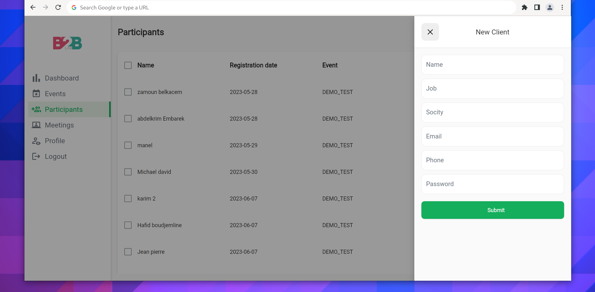
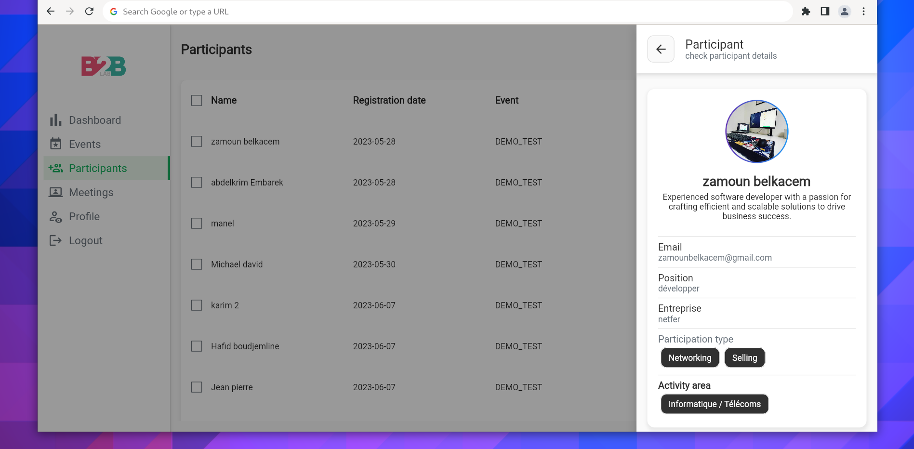

# b2b admin(WEB, ANDROID, IOS):

**b2b lab admin** is a Flutter application that i developed using flutter( frontend + api integration ) this is the admin version of [B2B Lab](https://github.com/zam101/b2blab) .

**key features**

- Event Creation and Management
- Participant Management
- Content Management
- Analytics/dashboard

## screenshots :
 
 
 
 
 
 
 
 
 
 

# Used Packages

This project utilizes the following Flutter packages:

- provider 
- go_router
- dio
- fl_chart
- charts_flutter
- lottie
- percent_indicator
- liquid_progress_indicator_v2
- google_fonts
- image_picker
- modal_side_sheet
- side_sheet 
- image_stack 
- shared_preferences 
- cached_network_image 
- calendar_date_picker2 
- flutter_rte
- material_design_icons_flutter 
- flutter_launcher_icons 
- url_launcher 
- cupertino_icons
